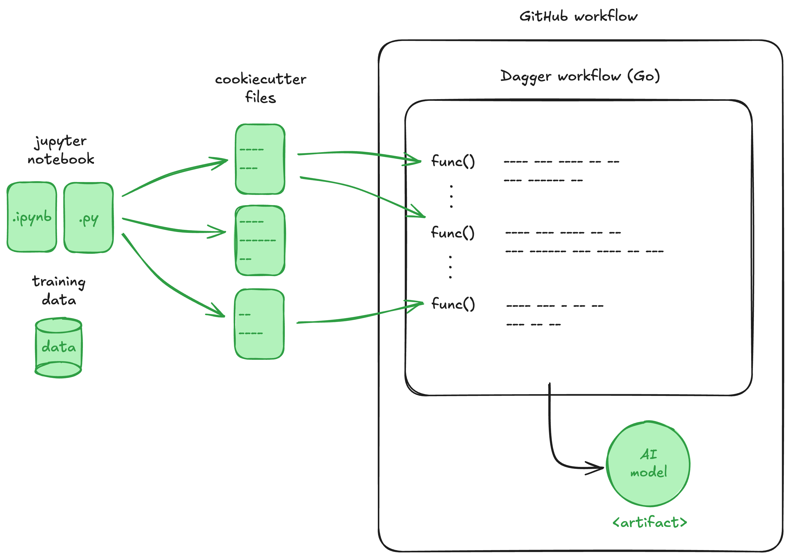

# ITU BDS SDSE'24 - Project

## Task

Based on the input provided (see below), fork the repository and restructure the code to adhere to the concepts and ideas you have seen throughout the course.  The diagram below provides a detailed overview of the structure that the solution is expected to follow.   

For the exam submission, we expect you to submit a pdf containing:
- the list of members of the group
- the link to the github.com private repository hosting your solution.  You will need to invite the three of us as collaborators: lasselundstenjensen, Jeppe-T-K, paolotell.

The repository linked in the submission should contain:

- A README.md file that describes the project
- GitHub automation workflow
- Dagger workflow (in Go)
- All history

## Inputs

You are given the following material:
- Python monolith (see `notebooks` folder)
- Raw input data (see `notebooks/artifacts` folder)
- GitHub action to test model inference (LASSE WHERE)

## Outputs

- Your GitHub repository (including all history)
  - A README.md file that describes the project
  - GitHub automation workflow
  - Dagger workflow (in Go)
- Model artifact produced by GitHub workflow

## How will we assess

Below, we provide information on how we will assess the submission clustered around several aspects.  The list relates to groups of size 3; if your group is of size 4, you are expected also to work on the optional items, i.e., to use pull requests and to provide tests.

#### Versioning

- Use of Git (semantic commit messages, branches, branch longevity, commit frequency/size)
- Management of data
- Use of pull requests (OPTIONAL)

#### Programming

- Decomposition of Python notebook
- Adherance to standard data science MLOps project structure
- Presence of tests (OPTIONAL)

#### Workflow automation

- Structure of Dagger workflow
- Orchestration of Dagger workflow through GitHub workflow

#### Documentation (README.md)

- Description of project structure
- How to run the code and generate the model artifact

## Questions

If you have any questions about the information shared here, please feel free to post them on Learnit. Answers to private emails on this topic will also be shared on Learnit, along with the original email content, so that everyone has access to the same information.
